# 旅游住宿找导游系统
基于SSM实现旅游住宿找导游系统，包括4种角色：管理员、导游、旅店老板、旅客。

详细介绍：[https://liuyanzhao.com/shop/TravelSystem.html](https://liuyanzhao.com/shop/TravelSystem.html)  
预览地址：[http://travelsystem.liuyanzhao.com](http://travelsystem.liuyanzhao.com)     
开发完成时间 2021年12月最近更新 

## 功能介绍
- 包含4个角色：管理员、导游、旅店老板、游客
- 两大核心功能：预定旅店、找导游

1）管理员  
- 景点管理
- 旅店客房管理
- 用户管理(管理员、导游、旅店老板和游客分别有管理)
- 导游订单管理
- 住宿订单管理
- 反馈管理(用户对导游和旅店订单都可以反馈)
- 登录、个人信息、密码管理

2）导游  
- 关联自己可以导游的景点
- 旅客的导游订单管理
- 旅客反馈受理
- 注册登录、个人信息、密码管理

3）旅店老板  
- 旅店住房管理
- 旅客的住宿订单管理
- 旅客反馈受理
- 注册登录、个人信息、密码管理

4）旅客  
- 预定客房，住宿订单管理
- 预约导游，导游订单管理
- 订单反馈
- 注册登录、个人信息、密码管理

## 技术组成
- SSM (Spring、SpringMVC、MyBatis)
- JSP
- Bootstrap + jQuery
- MySQL
- Maven

## 预览
1-首页1.png

2-首页2.png
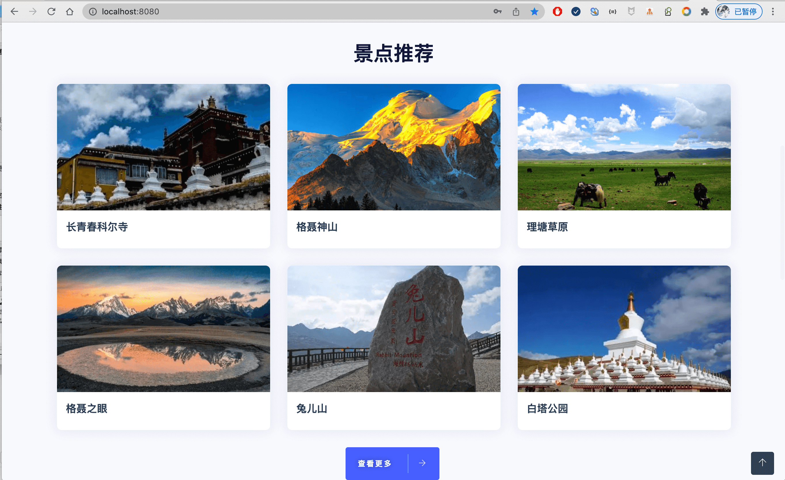
3-首页3.png
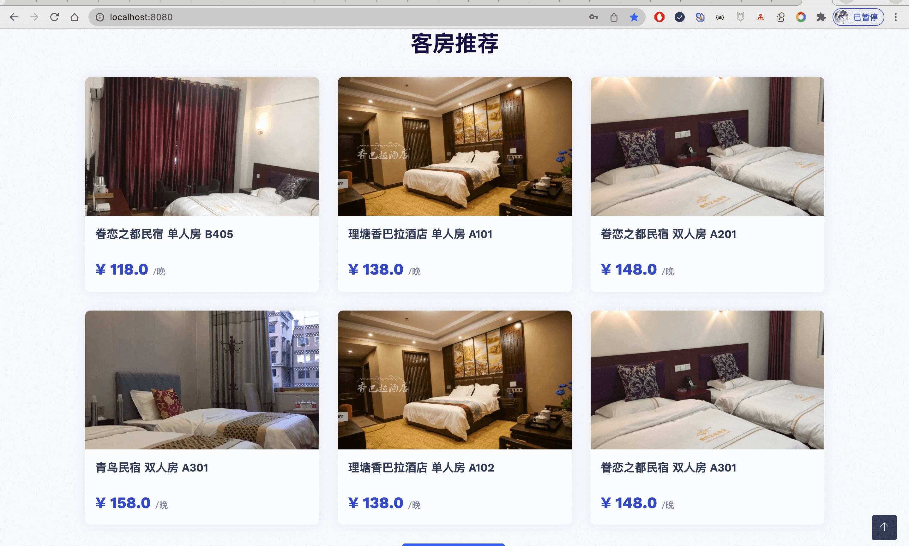
4-景点列表.png

5-景点详情1.png
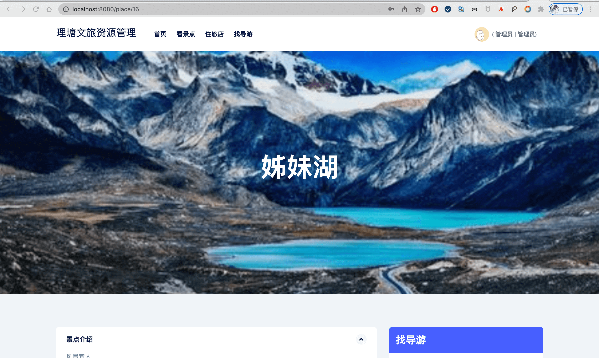
6-景点详情2.png

7-找导游1.png

8-找导游2.png

9-旅店列表.png
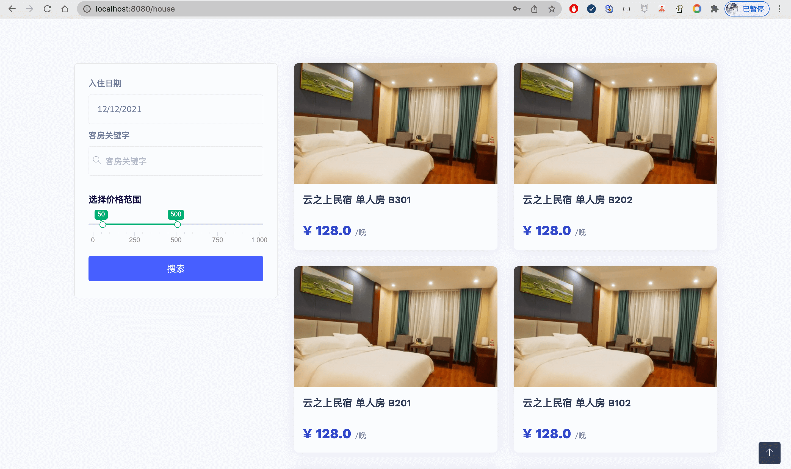
10-旅店详情1.png
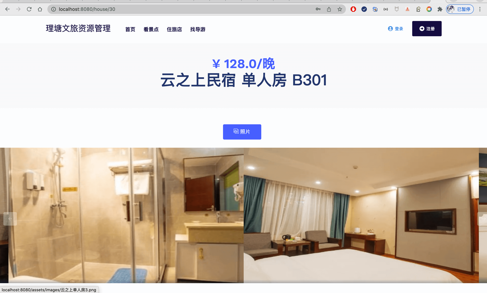
11-旅店详情2.png

12-登录页面.png
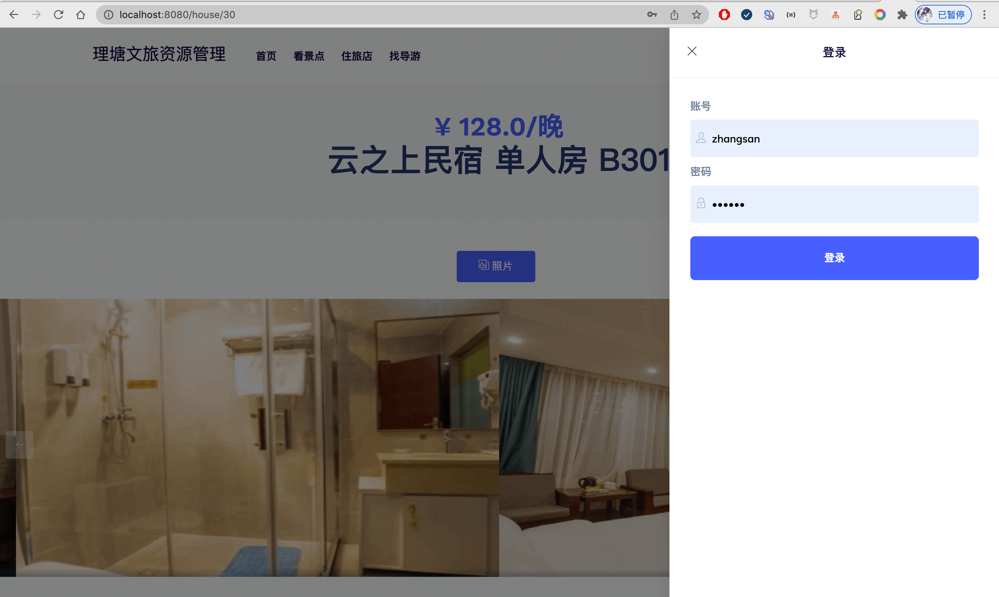
13-注册页面.png

14-预定旅店支付页面.png

15-我的住宿订单.png

16-我的导游订单.png
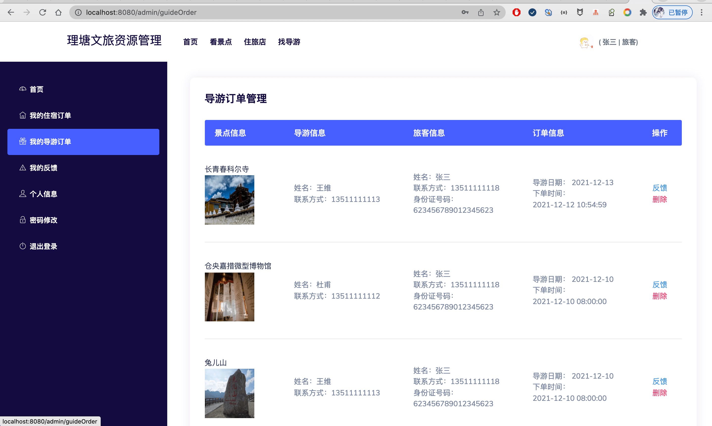
17-我的反馈.png
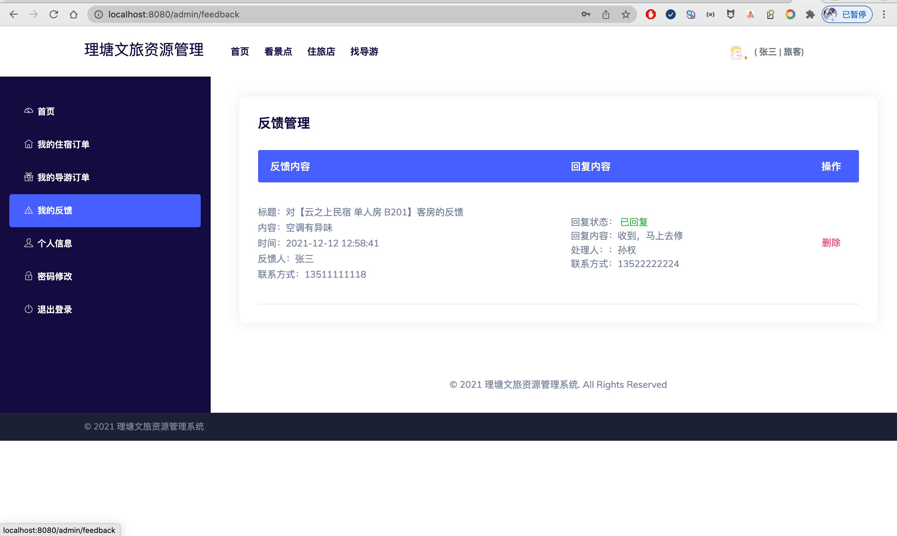
18-个人信息.png
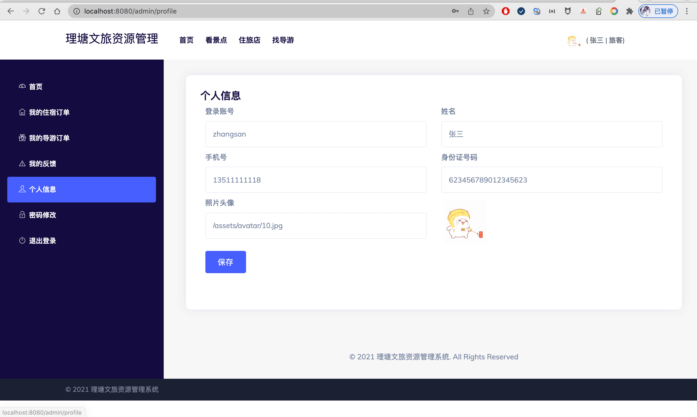
19-密码修改.png

20-提交反馈.png

21-客房列表.png
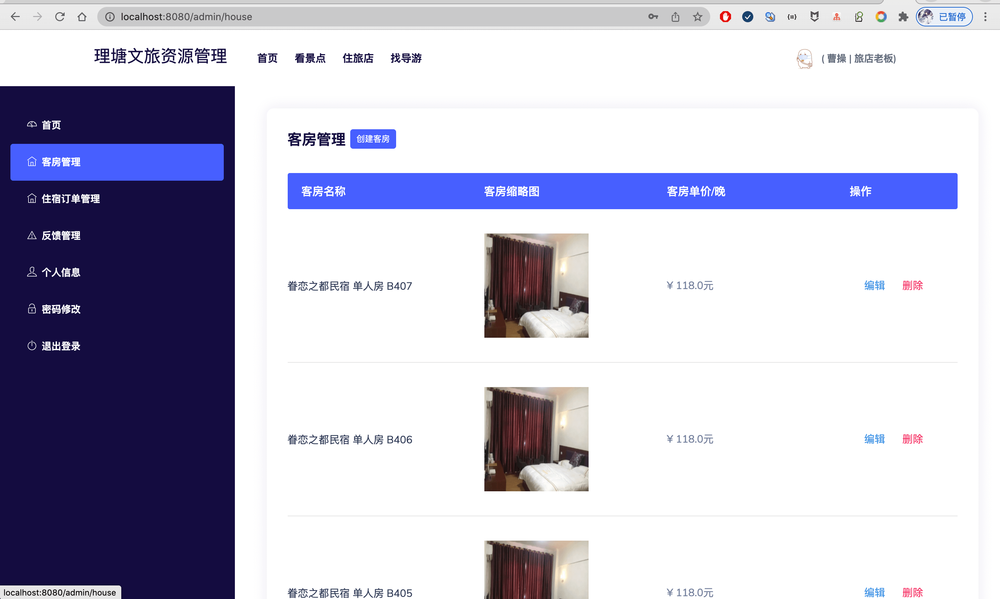
22-客房发布.png
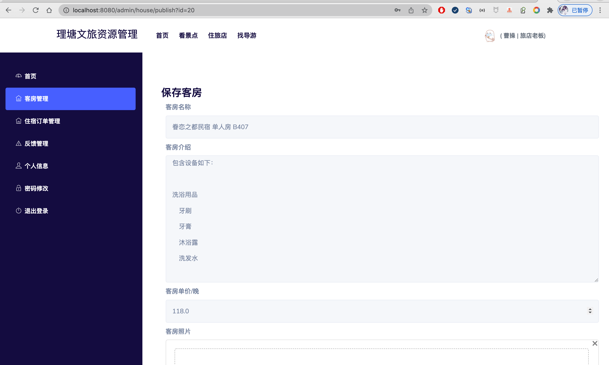
23-导游订单列表.png
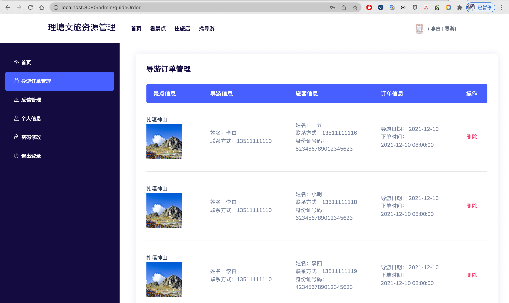
24-管理员景点管理.png

25-管理员客房管理.png

26-管理员住宿订单管理.png
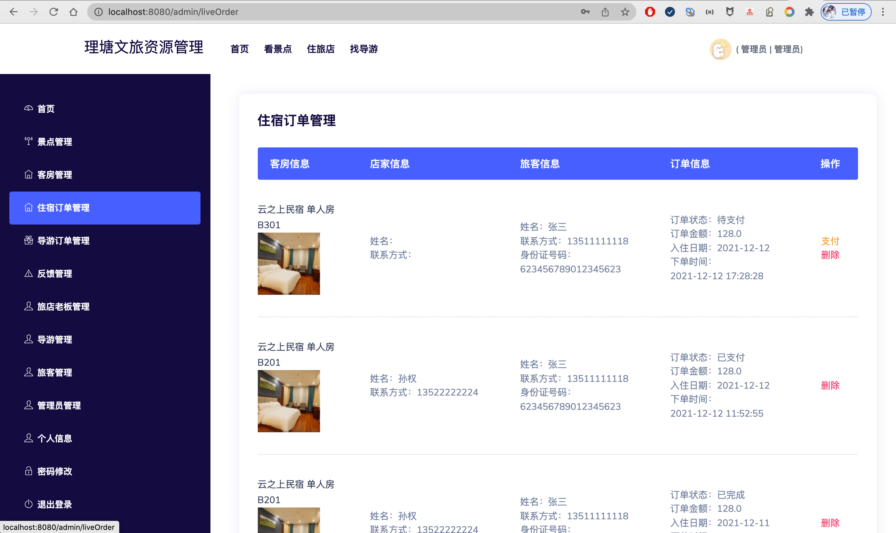
27-管理员导游订单管理.png

28-管理员反馈管理.png
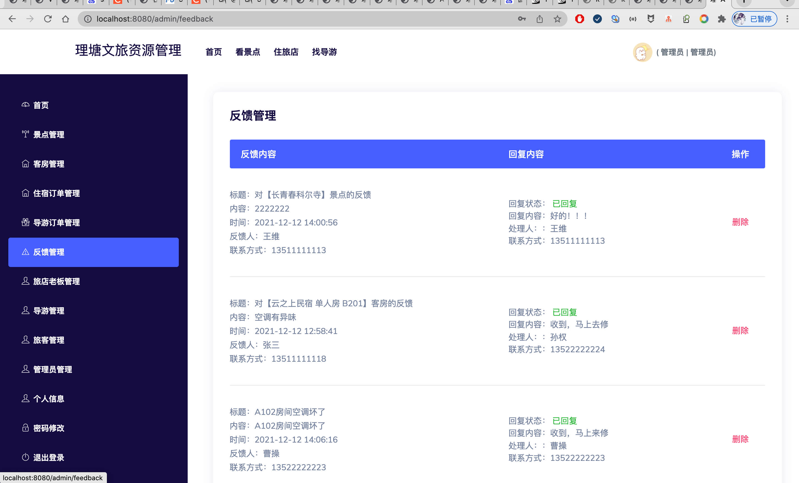
29-旅店老板管理.png
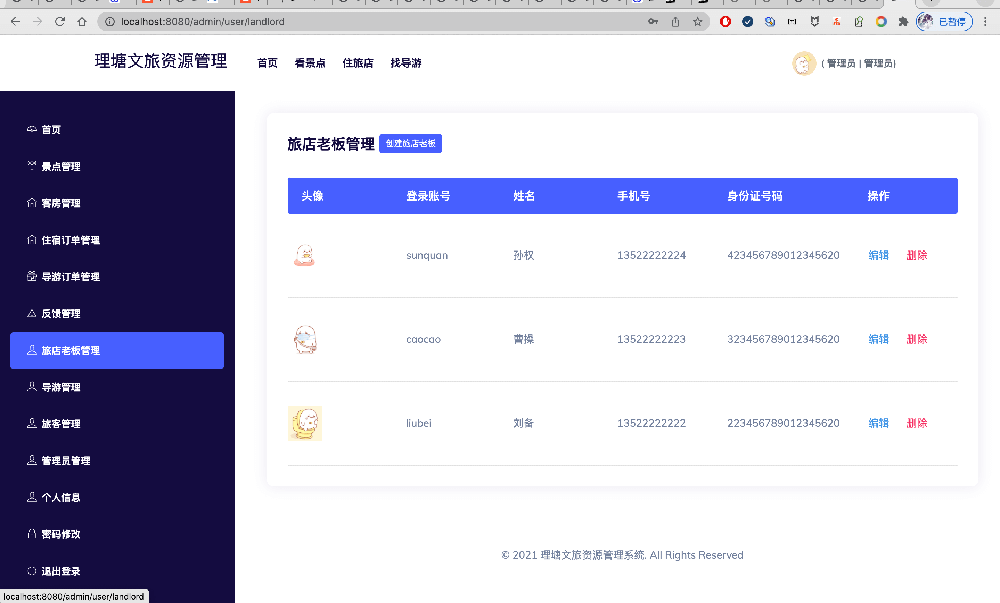
30-导游管理.png

31-旅客管理.png

32-导游个人信息设置关联景点.png
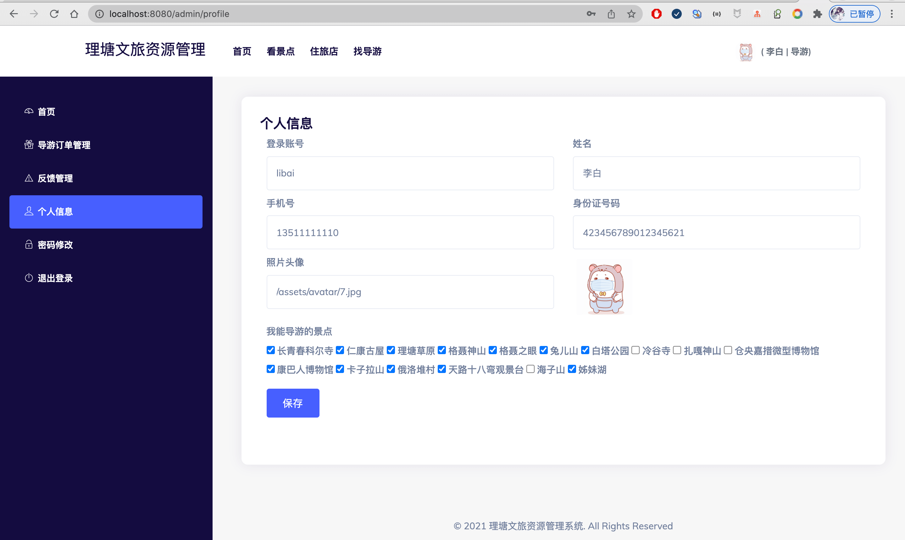

其他页面，请直接通过演示网站访问  
管理员账号 admin，房东 caocao，导游 libai， 租客 zhangsan  
密码 123456

## 联系方式
目前只开源部分后端代码，需要前端和sql等完整代码请联系博主  
同时也提供部署或问题解答服务   
微信/QQ：847064370  
[博主博客主页](https://liuyanzhao.com)  

## 日志

- 2021/12/1 1.0版本
   - 基本所有功能的实现
